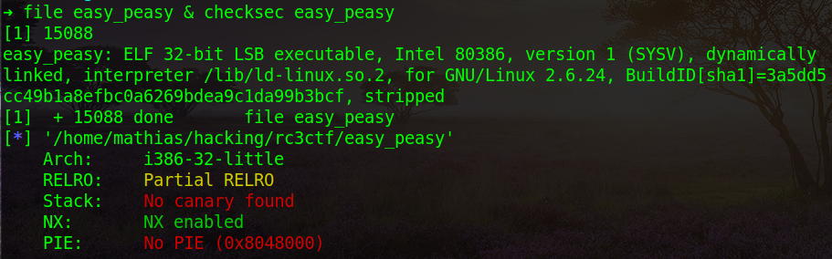
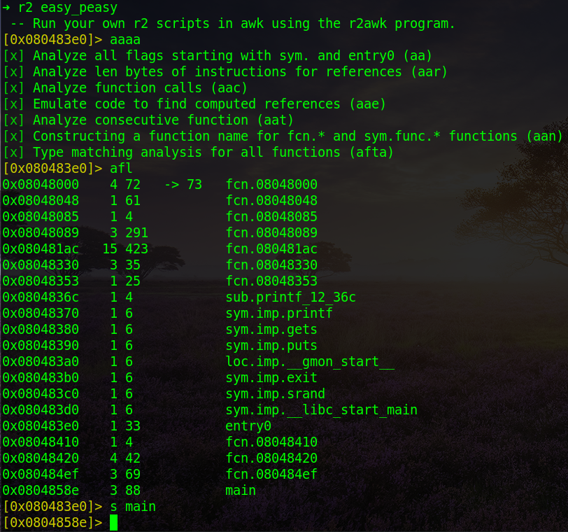
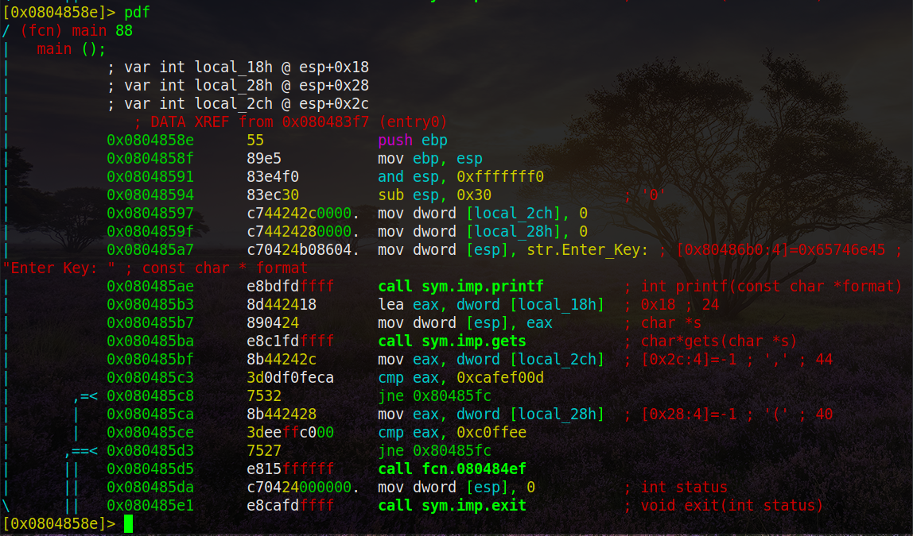
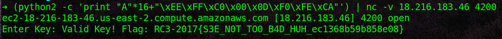

# PWN (100)

Nothing special to note except it's a 32 bits linux binary. Let's check the assembly instructions with radare2.

Seek the main function. Print the dissasembly.

There are 3 variables on the stack. Starting at esp+0x18, esp+0x28 and esp+0x2c. The program reads a key string using the c function gets and stores it in the buffer of the first variable at esp+0x18. This is definitely a buffer overflow.

The 2 other variables are set to 0 at the beginning of the function. However, each of these variables is compared to a different value than 0. The second variable on the stack is compared to 0xc0ffee. The third variable on the stack is compared to 0xcafef00d. It's not possible for these path branches to be taken, looking at it from the static perspectief. But since we have control over the variable values due to the buffer overflow on the first variable, it's possible to change the values in the last 2 variables on the stack at runtime.

Since the first 32 overflown bits are located in the buffer at variable 3, and the following 32 bits in the buffer at variable 2, both values need to be inversed in the payload. Carefully write a payload (for instance, offset 0x28 - offset 0x18 = 16 characters) to overflow the buffer at the first variable, then hardcore the values 0xc0ffee and 0xcafef00d. Keep in mind to write the 32 bits payloads in little endian. 

